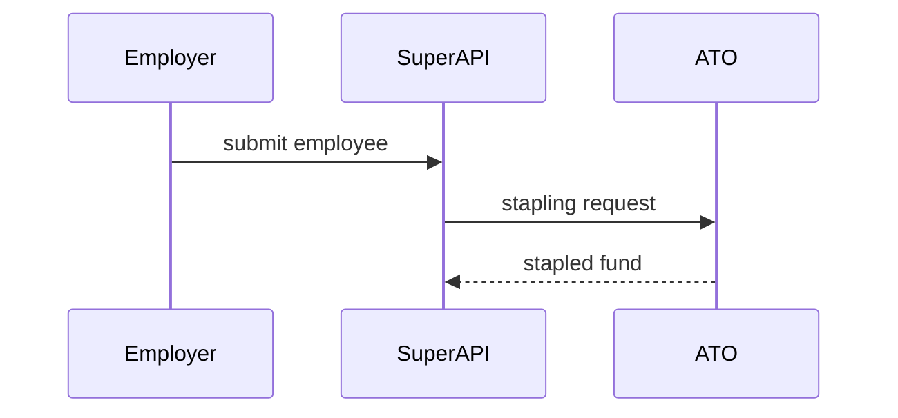

A PR description is the reviewer's way in. It tells them what problem the change solves and where to look, fast. The diff carries the detail.

## Template

```markdown
PRODUCT-123

<one or two sentences: the problem, then what the change does about it>

<optional: one visual>

What changed:

- <plain-language change>
- <plain-language change>

Notes: <where to start reviewing, known follow-ups, what is deliberately out of scope>
```

- The ticket line appears only when there is a ticket. Take it from the branch name or the conversation.
- `What changed:` bullets are one line each and describe behaviour in plain terms.

Skip all preamble and keep prose brief. Use the domain vocabulary from this repo's glossary, located per `~/.agents/skills/setup-braidon-skills/locate.md`.

Name things by what they do, never by where they live. File paths, module names, function names and line numbers stay out, and nothing gets backticks. The diff already carries those identifiers, and prose that repeats them goes stale on the next rename. Leave out test-plan sections, exhaustive change lists and attribution footers.

When the change needs a paragraph of mechanism to review safely, say so in `Notes:` and let the reviewer ask. Depth belongs in the review conversation.

## Visual

Add one visual when it shows the change faster than prose. A small change needs none. Pick the smallest view that makes the key point clear, and place it right after the sentences it supports. Label its nodes with domain words, not identifiers, so the rule above still holds.

- Logic or an algorithm as pseudocode:

```text
on nomination
  if the member already has a stapled fund
    keep it
  otherwise
    use the employer default
```

- Runtime control flow as a call tree:

```text
employer submits onboarding
  create session
    record employer details
    request stapling
  send to fund selection
```

- UI structure as a component tree, showing the state and boundaries that matter:

```text
fund selection page
  live fund search
  fund card
    promoted badge
```

- Interaction or data flow between parts with Mermaid:



- A `diff` sketch when the point is what changes and the surrounding shape already exists. Match the sketch to the topic.

For a call-tree change:

```diff
 employer submits onboarding
   create session
     record employer details
+    check ABN status
     request stapling
   send to fund selection
```

For a state or control-flow change:

```diff
 on save
-  write content
+  if content is unchanged
+    return the cached result
+  write new content
+  clear the cache
```

Keep only the steps, states and boundaries the reviewer needs to follow the change.

## Merge danger

When the change is a one-way door, add one sentence to `Notes:` naming it and its blast radius. A one-way door is a change a revert cannot undo: a migration that drops or rewrites data, a backfill, a destructive operation, a change to a public API or webhook contract, or a message already sent to an external party. Skip the sentence for two-way doors, since a cheap revert is the default and needs no mention.
